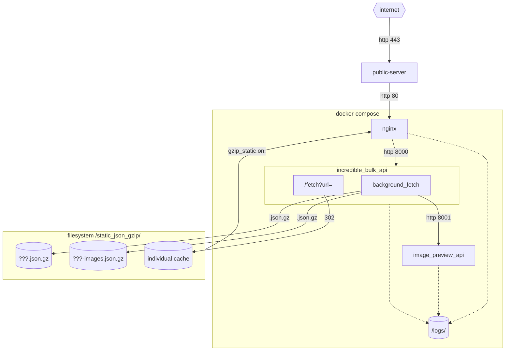

# incredibleBulkAPI

* API service for gzip batching of other REST services

---

http://localhost:8000/static_json_gzip/bff-car.json
http://localhost:8000/static_json_gzip/bff-car-images.json
http://localhost:8000/static/bulk_image_viewer.html?bulk_image_datafile=/static_json_gzip/bff-car-images.json

http://localhost:8000/fetch?url=https://bff-car-guacamole.musicradio.com/features&Accept=application/vnd.global.5%2Bjson

curl "http://localhost:8000/fetch?url=https://bff-car-guacamole.musicradio.com/features&Accept=application/vnd.global.5%2Bjson" -vvv

---

Problems
--------

1. Client performance
2. Service outage
3. Service history

Solution
--------

Architecture
------------

