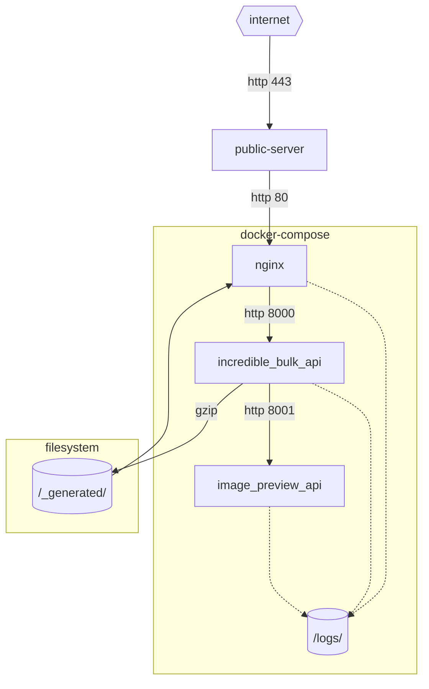

# incredibleBulkAPI

* API service for gzip batching of other REST services

---

http://localhost:8000/_generated/bff-car.json.gz
http://localhost:8000/_generated/bff-car-images.json.gz

---

Problems
--------

1. Client performance
2. Service outage
3. Service history

Solution
--------

Architecture
------------

