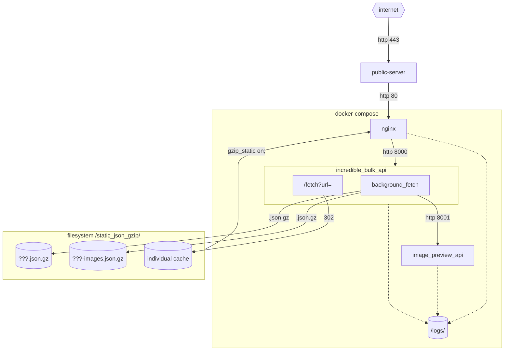

# incredibleBulkAPI

* API service for gzip batching of other REST services

---

http://localhost:8000/static_json_gzip/bff-car.json
http://localhost:8000/static_json_gzip/bff-car-images.json
http://localhost:8000/static/bulk_image_viewer.html?bulk_image_datafile=/static_json_gzip/bff-car-images.json

http://localhost:8000/fetch?url=https://bff-car-guacamole.musicradio.com/features&Accept=application/vnd.global.5%2Bjson

curl "http://localhost:8000/fetch?url=https://bff-car-guacamole.musicradio.com/features&Accept=application/vnd.global.5%2Bjson" -vvv

---

Problems
--------

* [Backends for Frontends pattern](https://learn.microsoft.com/en-us/azure/architecture/patterns/backends-for-frontends) is a powerful design pattern

1. Client performance
    * bff but it can lead to user interactions being performance bound to to the round trip time to the backend service.
    * For mobile clients on less reliable network connections, the bff-pattern can have a more pronounced impact on performance.
    * In addition to api data returns, clients often perform additional fetches for images. Adding to additional round trip time before a ui could become useable.
    * In development/testing of a client, developers often have exceptionally performant network connections. Real life performance of an application can often be hidden from developers.
2. Service outage
    * In the event of a service outage, clients can lock and become unusable for all operations.
3. Service history
    * Most api returns are transitive.
    * If we want to know what an api return looked like yesterday at midday, we have no history or information about this.

Solution
--------

* If the client could prefetch a batch/bulk of some of the hot/frequent data paths, perhaps we could have more responsive applications without the 'round trip' time.
* Possible client implementation
    * Client operates as normal, fetching data from a bff. In the background the client is fetching the batch/bulk data.
    * Clients check if a path is in the batch/bulk cache, if not, fetch as normal from bff, else display cached version.
* In addition to providing api data in batches, we can crawl the batch/bulk payloads for images. We can create a second payload with base64 encoded previews for images

### Example

`http://my-site/api/` -> Crawled with `incredibleBulkAPI` once per hour -> `/static_json_gzip/my-site.json.gz`+`/static_json_gzip/my-site.images.json.gz`

#### Example `my-site.json.gz`
```json
{
    "/path": {..., "image_url": "http://examples.com/fake.png"},
    "/path/with/extra/1": {..., "more": [{..., "logo": "logo1.png"},]},
    "/path/with/extra/2": {..., "more": [{..., "logo": "logo2.png"},]},
    "/path/amazing": {...},
    ...
}
```
#### Example `my-site.images.json.gz`
```json
{
    "http://examples.com/fake.png": "data:image/avif;base64,xxx",
    "logo1.png": "data:image/avif;base64,xxx",
    "logo2.png": "data:image/avif;base64,xxx",
}
```


### nginx: `gzip_static on;`

* The linux kernel has a low level operation to take binary content on disk and throws it out of a network socket as a dma transfer operation. This REALLY REALLY fast and handled by hardware.
* All data content is pre-gzipped and served from nginx with `gzip_static on;`
    * The python layer does not serve any data content directly

### Service outage? Single file

* `/fetch?url=xxx&accept=xxx` -> `302` -> `/static_json_gzip/cache/12345.json`
    * If background crawl task has been unable to fetch a new version, the `/static_json_gzip/cache/xxx.json.gz` will still be present as the last received version

### Moving beyond nginx? Cloud?

It could be possible to the pre-gzipped static content though a cloud/edge provider if needed with little modification.


Add a `site` to bulk
--------------------

Each site implements the interface

```python
class AbstractSiteModel:
    endpoint: str
    root_path: APIPath = "/"
    headers: t.Mapping[str, str] = {}
    cache_period: datetime.timedelta

    @abstractmethod
    def extract_crawl_paths(self, path: APIPath, payload: APIPayload) -> t.Iterable[APIPath]:
        ...

    @abstractmethod
    def continue_crawl(self, path: APIPath, depth: APIDepth, payload: APIPayload) -> bool:
        ...


class AbstractImageModel:
    @abstractmethod
    def extract_image_urls(self, data: APIBulk) -> t.Iterable[ImageUrl]:
        ...
```


Architecture
------------




Future
------

* Saving gzip could be a async stream to cloud service?